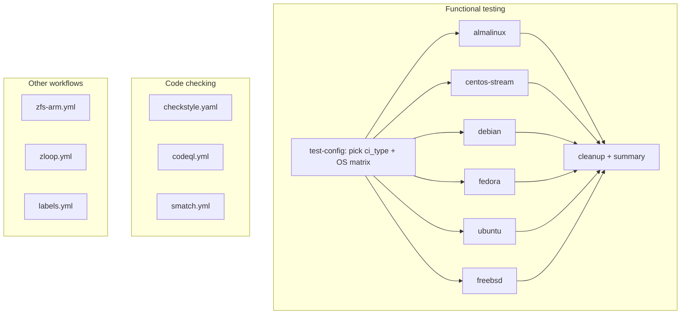

## CI overview

The main test pipeline is `zfs-qemu.yml`. Code checking and other
workflows run independently alongside it.



Every `qemu-vm` matrix entry runs on a fixed `ubuntu-24.04` host.
The steps inside one entry are:

1) set up QEMU and boot the guest (~2-4m)
2) install build dependencies in the guest (~2-4m)
3) build zfs modules in the guest (~8-12m)
4) run functional tests (~2-4h)
5) package and upload per-OS test logs (~10s)

A per-OS entry takes about 3 to 4 hours. Once all entries finish, the
`cleanup` job aggregates the results into a summary.

### `ci_type` selection

`test-config` runs `.github/workflows/scripts/generate-ci-type.py` against
the PR's changed files and picks one of:

| `ci_type` | OS matrix                                  |
|-----------|--------------------------------------------|
| `docs`    | empty (documentation-only PRs)             |
| `quick`   | 6 Linux + 1 FreeBSD                        |
| `linux`   | all supported Linux distros                |
| `freebsd` | all supported FreeBSD versions             |
| default   | cross-platform sample                      |

Pushes to `openzfs/zfs` skip the matrix entirely; only PRs (and pushes to
forks) build.

Authors can force a specific ci_type by adding `ZFS-CI-Type: <type>` to
the most recent commit message. The `ZTS_OS_OVERRIDE` repository variable
can also alter the selection. The `workflow_dispatch` trigger accepts
`fedora_kernel_ver` (Fedora-only run with a chosen kernel) and
`specific_os` (pin the matrix to one OS).

### Supported guests

Auto-selected:

- Linux: almalinux 8/9/10, centos-stream 9/10, debian 11/12/13,
  fedora 43/44, ubuntu 22/24/26
- FreeBSD: 14.4-RELEASE/STABLE, 15.1-RELEASE/STABLE, 16.0-CURRENT

Available via `specific_os` or `ZTS_OS_OVERRIDE`:

- archlinux, tumbleweed

### Code checking

- `checkstyle.yaml`: source-style checks
- `codeql.yml`: CodeQL analysis
- `smatch.yml`: smatch analysis

### Other workflows

- `zfs-arm.yml`: ARM build on `ubuntu-24.04-arm`
- `zloop.yml`: host-side zloop
- `labels.yml`: maintains PR status labels
- `zfs-qemu-packages.yml`: manually dispatched, builds release RPMs or
  tests RPM installation from the ZFS yum repo

### TrueNAS fork specifics

Upstream workflows are kept as close to openzfs/zfs as possible;
TrueNAS additions live in fork-only files.  `zfs-qemu.yml` is
unmodified and keeps testing the stock Debian kernel (matrix pinned
to `["debian13"]` via the `ZTS_OS_OVERRIDE` repository variable).

[`.github/trains.json`](../trains.json) is the single source of
truth: each `trains[]` entry pairs one ZFS branch with the rolling
TrueNAS kernel release (`kernel_repo` + `kernel_tag`) it is built,
tested and published against.  Unlisted branches use the
`default_train` pairing and publish nothing.  Every lookup goes
through `scripts/resolve-train.py`, which validates the whole file -
required fields, value shapes, unique train and branch names, a
resolvable `default_train` - so a bad edit fails where it is made.
Consumers:

- `ci.yml`: builds native debs against the paired kernel headers in a
  `debian:trixie` container.  A push to a paired branch republishes
  them as this repo's rolling `<train>-nightly` release, with
  `SHA256SUMS` and a `manifest.json` recording the exact kernel used.
  Only branch refs publish, so a tag sharing a branch's name cannot
  race it over the release.
- `kernel-watch.yml` (scheduled, default branch only): every six
  hours, compares each train's published debs with its kernel release
  and dispatches `ci.yml` on the paired branch when they diverge -
  kernel moved, pairing changed, or nothing published yet.
- `zfs-qemu-tn.yml`: runs the zfs-qemu sequence on the same Debian 13
  image rebooted into the paired TrueNAS kernel (`debian13-tn`, via
  `scripts/qemu-tn-kernel.sh`).  Fails only here: suspect the TrueNAS
  kernel; fails in zfs-qemu too: suspect the ZFS change.  PRs follow
  their base branch; the `kernel_train` dispatch input can force any
  configured train.  Runs on every pull request, but on push only for
  the paired branches, so a PR branch is not tested twice over.

A branch always builds, tests and publishes from **its own** copy of
trains.json, and kernel-watch reads each pairing back from that same
copy - it only takes the list of branches to watch from the default
branch.  So the copies never have to be byte-identical; a branch that
does not carry trains.json yet is reported as not onboarded and left
alone, rather than dispatched a build it cannot run.

#### Adding a watched release (train)

1. The kernel must already be published: `<kernel_repo>` needs a
   rolling `<kernel_tag>` release carrying `manifest.json`,
   `SHA256SUMS` and `linux-{image,headers}-*` debs, like
   [truenas/linux](https://github.com/truenas/linux/releases).
2. Land the pairing on the branch first, together with this `ci.yml`
   (its `workflow_dispatch` trigger is what kernel-watch dispatches)
   and this `zfs-qemu-tn.yml`:

   ```json
   { "train": "27", "branch": "stable/27",
     "kernel_repo": "truenas/linux", "kernel_tag": "27-nightly" }
   ```

3. Add the same entry to the default branch's trains.json, which is
   what puts the train under kernel-watch.  Until then the branch
   simply builds and tests against its own pairing without being
   watched; do it the other way round and kernel-watch warns that the
   branch is not onboarded.
4. Nothing else: within six hours kernel-watch sees no
   `<train>-nightly` debs and dispatches the first build.  Trigger
   the "Kernel watch" workflow manually to skip the wait.

#### Retiring a train

Order matters, because the paired branch publishes from its own copy:

1. Delete the entry from the **paired branch's** trains.json, so its
   ci.yml stops republishing `<train>-nightly` on every push.
2. Delete it from the default branch's trains.json, so kernel-watch
   stops checking it.
3. Remove the leftover `<train>-nightly` release and tag by hand.

Doing step 3 before step 1 only resurrects the release on the next
push to the branch, and nothing watches it any more.
